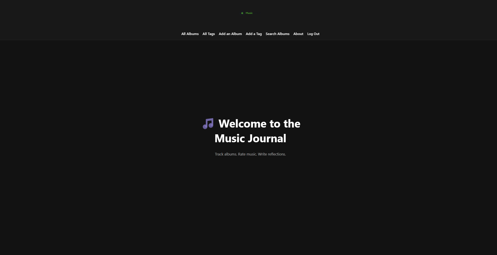

## App Screenshot

🎵 Music Journal

Music Journal is a full-stack Django web application that allows users to track albums they enjoy, write notes about them, rate them, and explore music using the Spotify API.

The app functions as a personal music diary while also allowing users to browse albums added by other users and leave reviews.

Deployed app: https://musicjournal-ecccb8d477a5.herokuapp.com/

---------------------------------------------------------------------------------------------------------------------------------

📚 Description

Music Journal allows users to:

• Create and manage albums in their personal journal
• Search Spotify for albums and import them directly into the app
• Search for songs using Spotify and attach them to albums
• Listen to song previews when Spotify provides them
• Add listening history entries
• Add and organize tags
• Leave public reviews on album pages
• View albums added by other users

The goal of the project was to build a full CRUD Django application with external API integration and user authentication.

-----------------------------------------------------------------------------------------------------------------------------

🧠 Technologies Used

Backend

Python

Django

PostgreSQL

Frontend

HTML

CSS

Django Templates

External Services

Spotify Web API

Authentication

Django built-in authentication system

--------------------------------------------------------------------------------------------------------------------------------

🔗 Spotify API Integration

The app connects to the Spotify Web API using a Client Credentials authentication flow.

The API is used to:

Search for albums

Search for songs

Retrieve album artwork

Retrieve Spotify links

Retrieve song preview URLs

Users can then import albums or songs from Spotify directly into their journal.

-------------------------------------------------------------------------------------------------------------------------------

👤 User Features

Users can:

Sign up and log in

Create albums in their journal

Edit or delete their own albums

Add listening history

Add or remove tags

Import songs from Spotify

Preview songs

Leave reviews on albums

Users can also view albums created by other users, but only the album owner can edit or delete their album.

-------------------------------------------------------------------------------------------------------------------------

🗂 Models

The main database models include:

Album

Stores album information including title, artist, year, rating, notes, artwork, and the user who added it.

Tag

Allows albums to be categorized using a many-to-many relationship.

Listening

Tracks listening history entries for albums.

Song

Stores Spotify song information linked to an album.

Review

Allows users to leave public reviews on album pages.

------------------------------------------------------------------------------------------------------------------------

📄 Key Pages

Home Page
Login page for users.

Album List
Displays all albums in the app.

Album Detail
Shows album information, listening history, tags, songs, and reviews.

Spotify Search
Allows users to search Spotify for albums to import.

Song Search
Allows users to search Spotify for songs and attach them to albums.

------------------------------------------------------------------------------------------------------------------------------

🔐 Authentication & Authorization

The app uses Django’s authentication system.

Users must log in to access the app.

Authorization rules:

Any user can view albums

Only the album owner can edit or delete an album

Reviews can be posted by any logged-in user

------------------------------------------------------------------------------------------------------------------------------

🖼 Screenshots

(Add screenshots of your app here before submission)

Examples:

Album list page

Album detail page

Spotify search page

Song preview feature

-------------------------------------------------------------------------------------------------------------------------------------

🚀 Future Improvements

Possible future features include:

User profile pages

Following other users

Average album ratings

Playlist creation

More advanced Spotify integration

Sorting and filtering albums

Social feed of recent reviews
---------------------------------------------------------------------------------------------------------------------------------------

